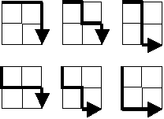

# Test technique Folhomee stagiaire

## Contexte

Le buts de ce test technique sont les suivants :

- Nous permettre de voir votre niveau technique
- Essayer de déterminer vos capacités concernant la résolution de problèmes
- Voir si vous pourriez vous intégrer au sein de notre équipe technique

Au cours de ce test technique, vous allez réaliser de petits exercices logique

Il est important de respecter les consignes suivantes :

- Ne sautez pas un exercice, il faut respecter l'ordre
- Vous n'avez pas besoin d'utiliser un service extérieur pour les exercices
- Il est très facile de trouver des résolutions/solutions de ce test en ligne, aussi vous serez jugé sur votre capacité de structurer votre code
- Essayez de trouver une méthode pour résoudre _rapidement_ l'exercice sur une machine avec de faibles ressources

## Livrables

Les livrables minimum sont les suivants :

- Un repo github privé auquel vous aurez donné accès au CTO de Folhomee (username github : [milanito](https://github.com/milanito))
- Un ensemble de dossiers/fichiers selon une nomenclature claires
- Pour chacun des exercices, le temps que vous avez mis à le réaliser au travers d'un README que vous essayerez de détailler (le markdown est recommandé), de préférences individuellement pour chaque partie

Vous êtes libres sur le choix du langage et l'algorithme de résolution

> Pour chaque exercices, si vous avez un moyen pour nous permettre de le lancer/tester, c'est toujours mieux

## Exercices

### Problème #1

Si nous listons tous les nombres naturels inférieurs à 10 qui sont des multiples de 3 ou 5, nous obtenons 3, 5, 6 et 9. La somme de ces multiples est 23.

**Quelle est la somme de tous les multiples de 3 ou 5 en dessous de 1000 ?**

> Pensez que l'on va vous demander en dessous de 1000000000

### Problème #2

Une séquence de Collatz se définie comme ceci, pour un entier n donné

- Si n est pair, on renvoie `n/2`
- Si n est impair, on renvoie `3n + 1`

Par exemple, en commencant par 13, on génére la séquence suivante

```
13 -> 40 -> 20 -> 10 -> 5 -> 16 -> 8 -> 4 -> 2 -> 1
```

Nous pouvons voir qu'en commencant par 13 (et en finissant par 1) la séquence contient 10 termes. Même si cela n'a pas été prouvé (Problème de Collatz), il est admis que quelque soit le nombre de départ, on termine toujours sur 1.

**Quel nombre, inférieur à 1 million, produit la séquence la plus longue ?**


### Problème #3

Si on commence du coin en haut à gauche sur une grid 2X2, et en ayant seulement le droit de bouger à droite ou vers le bas, il y a exactement 6 routes vers le coin en bas à droite



**Combien de routes peut-on avoir sur une grid de 20X20 ?**

> Pensez que l'on va vous demander sur une grid de 1000X1000
